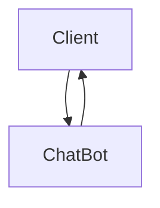

# Chatbot

We will focus specifically on the domain of a shipping company for our chatbot, we will start by just focusing on the receiving end of the shipping. 
User call the chat bot by calling "Hello". 
If the comment is invalid, the bot will shows waht the user type and return. 
After the bot is called User can chooes the service by enter the number: 
1 issue with the item 
2 item not yet received 
3 comments to the item 
Additionally in the third option you can ask for date and time  
4 for the person-person customer service 
The Bot will show different comments for different choices. 
If the comment is invalid, the bot will return and request the user to choose again

<<<<<<< HEAD
The basic features is just a GUI with input and output, that output is manually programmed logic.
As described above the various features are simply the different options to start the conversation.
Their is also an autocorrect feature, but it still has a few bugs.

=======

>>>>>>> 68c8abf3b7313e44816f7d0996bcf04448c333bf
